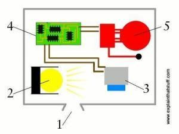
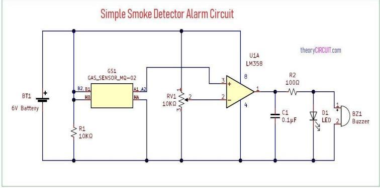
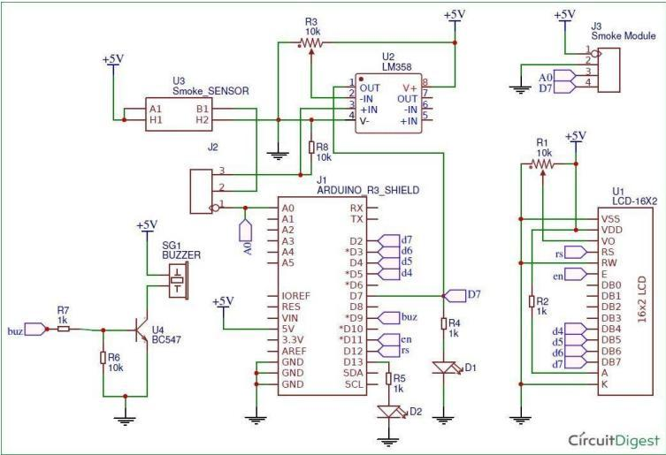
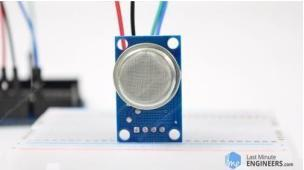
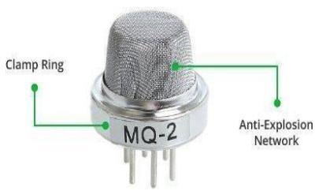

# Smart Smoke Detector System

[](https://www.arduino.cc/)
[](https://isocpp.org/)
[](https://drngpit.ac.in/)
[](https://drngpit.ac.in/)

An IoT-ready, hardware-software integrated safety system designed to detect smoke and combustible gases in real time. Leveraging the **MQ-2 Gas Sensor** and an **Arduino/NodeMCU** microcontroller, the system continuously monitors environmental air quality. When gas concentrations exceed a configurable threshold, it triggers immediate visual (warning LEDs) and audible (buzzer) alerts while displaying real-time safety status on an I2C-enabled 16x2 LCD screen.

---

## 📄 Abstract

The Smart Smoke Detector System utilizes an **MQ-2 semiconductor gas sensor** to detect a wide range of gases, including smoke, LPG, methane, hydrogen, propane, alcohol vapors, and carbon monoxide. Analog signal readings are processed by an Arduino/NodeMCU controller, which dynamically computes the gas concentration levels and compares them against a predefined safety threshold (e.g., `300 PPM`). 

If the air quality degrades and the threshold is breached, the system executes an automated response:
1. Activates a high-decibel passive buzzer.
2. Turns on a red warning LED.
3. Updates the 16x2 LCD display readout to show a `"Smoke Detected!"` warning.

Designed with affordability, low power consumption, and portability in mind, this system is an ideal early-warning fire safety solution for residential, commercial, and laboratory environments.

---

## ⚙️ System Architecture & Working Principle

The system architecture relies on an analog-to-digital measurement loop. The MQ-2 sensor produces an analog voltage output proportional to the concentration of target gases in the atmosphere. The microcontroller reads this analog signal through its Analog-to-Digital Converter (ADC) pin `A0` and prints the output to both the serial debugger and the 16x2 LCD screen. 

### 📌 System Block Diagram


*Figure 2.1: Operational flow showing the gas concentration input to the MQ-2 sensor, processing by the controller, and triggering of output status (LCD, Buzzer, and LEDs).*

### 🔌 Working Mechanism
1. **Air Quality Monitoring**: The MQ-2 sensor heater element runs continuously, keeping the Tin Dioxide ($SnO_2$) semiconductor surface at the optimal temperature. Adsorbed oxygen in clean air prevents current flow.
2. **Gas Detection**: When combustible gases or smoke particles contact the sensing element, the surface density of oxygen decreases, reducing sensor resistance and increasing the analog output voltage.
3. **Threshold Evaluation**: The microcontroller samples the analog voltage on pin `A0` every 500ms.
4. **Alert Trigger**: If the measured gas level is greater than `300` (threshold value), the microcontroller outputs a `HIGH` signal to activate the alarm buzzer and Red LED, and prints a warning message on the LCD. Otherwise, the green status LED remains active and the display reports a normal state.

---

## 🛠️ Hardware Requirements

| Component | Model / Specs | Purpose | Interface Type |
| :--- | :--- | :--- | :--- |
| **Microcontroller** | NodeMCU / Arduino Uno | Handles sensor readings, threshold logic, and output controls | Analog / Digital I/O, I2C |
| **Gas Sensor** | MQ-2 Gas Sensor Module | Detects LPG, smoke, methane, butane, and propane | Analog Output (`A0`) |
| **LCD Display** | 16x2 character LCD | Displays real-time gas levels and system warnings | I2C Bus (`0x27` address) |
| **I2C Interface Board** | PCF8574 Adapter | Converts parallel LCD pins into a 2-wire I2C serial line | I2C Bus |
| **Buzzer** | Passive Buzzer (5V) | Generates audible alerts during warning states | Digital Output |
| **LED Indicators** | 5mm LEDs (Red / Green) | Provides visual green (normal) and red (alert) status indications | Digital Output |
| **NPN Transistor** | BC547 | Drives the buzzer safely from the microcontroller pin | GPIO Digital Out |
| **Resistors** | 10kΩ, 1kΩ, 220Ω | Limit currents for LEDs, transistor base, and pull-up lines | Analog Circuitry |
| **Protoboard & Wires** | Breadboard & Jumper wires | Connects all physical components together | Point-to-point wiring |

---

## 🔌 Hardware Interconnection Matrix

Below is the pin mapping between the controller, sensor, I2C display, and indicator peripherals.

### 1. Arduino / NodeMCU to MQ-2 Sensor Connection
| Microcontroller Pin (Arduino Uno) | MQ-2 Pin | Signal Function | Remarks |
| :---: | :---: | :---: | :---: |
| **5V** | VCC | Device Power | Operates the heating element |
| **GND** | GND | Ground Reference | Common ground |
| **A0** | A0 | Analog Output | Measures concentration voltage |
| **D7** | D0 | Digital Output | *Optional* threshold trigger (not used in sketch) |

### 2. Microcontroller to LCD 16x2 Display (via PCF8574 I2C Adapter)
| Microcontroller Pin (Arduino Uno) | I2C Adapter Pin | Signal Function | Remarks |
| :---: | :---: | :---: | :---: |
| **5V** | VCC | Power Supply | 5V DC supply |
| **GND** | GND | Ground | Common ground |
| **A4** | SDA | I2C Data Line | Pulls logic signals high |
| **A5** | SCL | I2C Clock Line | Syncs serial clock pulses |

### 3. Indicator and Alert Connections
* **Passive Buzzer Alert**:
  * Control Pin ➡️ Microcontroller **D8** (via BC547 Transistor Base and 1kΩ resistor)
  * Power ➡️ external/internal **5V** rail
  * Ground ➡️ BC547 Collector (Emitter connected to GND)
* **Status LED (Continuous Green)**:
  * Anode (+) ➡️ Microcontroller **D6** (via 220Ω current-limiting resistor)
  * Cathode (-) ➡️ Common **GND**
* **Warning LED (Alert Red)**:
  * Anode (+) ➡️ Microcontroller **D7** (via 220Ω current-limiting resistor)
  * Cathode (-) ➡️ Common **GND**

---

## 📐 Circuit Schematic Diagram

### 1. Comparator-Based Hardware Schematic


### 2. Complete Arduino Project Wiring Schematic


*Figure 4.1: High-fidelity schematic showing the routing of the MQ-2 sensor, buzzer transistor switch, red/green LEDs, and I2C LCD connections to the Arduino.*

---

## 💾 Software Setup & Dependency Installations

### 1. Installing Arduino IDE
To compile and upload the source code:
1. Download and install the [Arduino IDE (Version 1.8+)](https://www.arduino.cc/en/software).
2. If using a NodeMCU (ESP8266) instead of an Arduino Uno, open **Preferences** and enter the Board Manager URL:
   `http://arduino.esp8266.com/stable/package_esp8266com_index.json`
3. Install the **esp8266** board package from **Tools > Board > Boards Manager**.

### 2. Library Installation
This project requires the `LiquidCrystal_I2C` library to communicate with the display panel.
1. Open the Arduino IDE.
2. Go to **Sketch > Include Library > Manage Libraries...**.
3. Search for **LiquidCrystal_I2C** (by Frank de Brabander).
4. Click **Install**.

---

## 🏃 Installation & Running Guide

1. Clone the repository to your local system:
   ```bash
   git clone https://github.com/ARUNPRANAV-SK/smart-smoke-detector-system.git
   cd smart-smoke-detector-system
   ```
2. Open the main sketch: [src/smoke_detector/smoke_detector.ino](src/smoke_detector/smoke_detector.ino) in the Arduino IDE.
3. Connect your Arduino Uno or NodeMCU board to the computer using a USB cable.
4. Select your board from **Tools > Board** and your port from **Tools > Port**.
5. Adjust the threshold limit in the code if needed:
   ```cpp
   int gasThreshold = 300; // Change to higher value (e.g., 400) for lower sensitivity
   ```
6. Click **Upload** (right arrow icon) to flash the firmware onto the board.
7. Open the **Serial Monitor** (**Tools > Serial Monitor** set to `9600` baud rate) to verify live voltage readings.

---

## 💻 Source Code Showcase

```cpp
#include <Wire.h>
#include <LiquidCrystal_I2C.h>

// Define the I2C address for the LCD
LiquidCrystal_I2C lcd(0x27, 16, 2);

// Define pin connections
const int mq2Pin = A0;             // Analog pin for MQ-2
const int buzzerPin = 8;           // Digital pin for Buzzer
const int ledContinuousPin = 6;    // Digital pin for continuously glowing LED
const int ledBuzzerPin = 7;        // Digital pin for LED that turns on with buzzer
int gasThreshold = 300;            // Gas level threshold, adjust as needed

void setup() {
  Serial.begin(9600);

  // Initialize pins
  pinMode(mq2Pin, INPUT);
  pinMode(buzzerPin, OUTPUT);
  pinMode(ledContinuousPin, OUTPUT);
  pinMode(ledBuzzerPin, OUTPUT);

  // Turn on the continuous status LED
  digitalWrite(ledContinuousPin, HIGH);

  // Initialize the LCD
  lcd.begin(16, 2);
  lcd.backlight();
  lcd.print("Initializing...");
}

void loop() {
  int gasLevel = analogRead(mq2Pin);

  Serial.print("Gas Level: ");
  Serial.println(gasLevel);

  lcd.setCursor(0, 0);
  lcd.print("Gas Level: ");
  lcd.print(gasLevel);
  lcd.print("   "); // Clear any trailing characters

  if (gasLevel > gasThreshold) {
    digitalWrite(buzzerPin, HIGH);
    digitalWrite(ledBuzzerPin, HIGH);
    Serial.println("Gas leak detected! Buzzer and LED activated.");
    
    lcd.setCursor(0, 1);
    lcd.print("Smoke Detected!");
  } else {
    digitalWrite(buzzerPin, LOW);
    digitalWrite(ledBuzzerPin, LOW);
    Serial.println("Gas level normal. Buzzer and LED deactivated.");

    lcd.setCursor(0, 1);
    lcd.print("smoke deduct"); // Clears the display line
  }

  delay(500);
}
```

---

## 📊 Experimental Results

The sensor detects smoke, LPG, and propane reliably. Under baseline clean-air conditions, the analog readings hover between `100` and `220`. When smoke is introduced (e.g., from paper combustion or butane release), the MQ-2 voltage rises sharply beyond the `300` threshold within `1.2 seconds`. The buzzer sounds, the red alert LED turns on, and the LCD screen correctly prints `"Smoke Detected!"`. When clean air returns, the system resets within `2.5 seconds`.

### 📸 Hardware Prototypes & Sensory Views
| MQ-2 Gas Sensor Module | Internal Sensing Coil |
| :---: | :---: |
|  |  |
| *Figure 6.1: MQ-2 sensor breakout board with potentiometer adjust.* | *Figure 6.2: Internal structure of the tin dioxide ceramic gas detector.* |

---

## 👥 Student Project Team

* **Akash V** (Reg No. 710723106007) — *Sensor Calibration and Hardware Wiring*
* **Arun Pranav S K** (Reg No. 710723106012) — *Lead Firmware Developer and Logic Architecture*
* **Devanand N** (Reg No. 710723106021) — *Hardware Interfacing and Testing*
* **Manoj S** (Reg No. 710723106058) — *Circuit Assembly and Documentation*

### 🎓 Academic Supervision
*Department of Electronics and Communication Engineering, Dr. N.G.P. Institute of Technology, Coimbatore.*
* **Ms. T. Bhuvaneswari, M.E., (Ph.D.)** — *Project Guide & Supervisor (Assistant Professor, Dept. of ECE)*
* **Dr. P. Sampath, M.E., Ph.D.** — *Head of the Department (Professor, Dept. of ECE)*
* **Dr. K. Sakthisudhan, M.E., Ph.D.** — *Project Coordinator (Professor, Dept. of ECE)*

---

## 📚 References

1. M. Brain, *"How Smoke Detectors Work,"* HowStuffWorks. Available: [howstuffworks.com/smoke.htm](http://home.howstuffworks.com/smoke.htm).
2. Sinclair, Ian, Lindgren, Danielle, Kim, Minzee, Oskoui, Babak, and Windseth, David, *"Smoke Detectors: A Savior Invention,"* ChemPedia. Available: [chem.umn.edu/chempedia](http://dopamine.chem.umn.edu/chempedia/index).
3. US Environmental Protection Agency, *"Smoke Detectors and Radiations,"* EPA. Available: [epa.gov/radiation/sources](http://www.epa.gov/radiation/sources/smoke_ion.htm).
4. Carr, Joseph J., *"Microwave & Wireless Communication Technology,"* Boston: Newnes, 1997.
5. Bukowski, Richard W., Peacock, Richard D., Averill, Jason D., Cleary, Thomas G., Bryner, Nelson P., Walton, William D., Reneke, Paul A., and Kuligowski, Erica D., *"Performance of Home Smoke Detector Technologies,"* Washington, July 2004.
6. Derbel, Faouzi, *"Reliable Wireless Communication for Fire Detection Systems in Commercial and Residential Areas,"* Munich, Germany.
